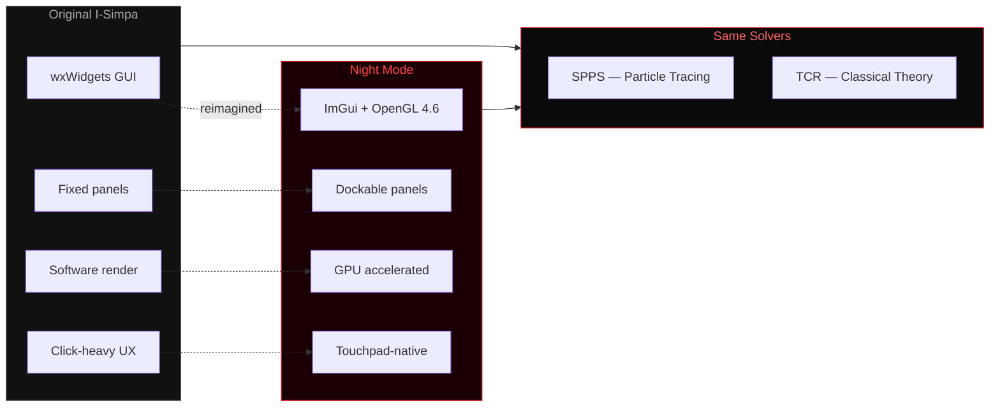
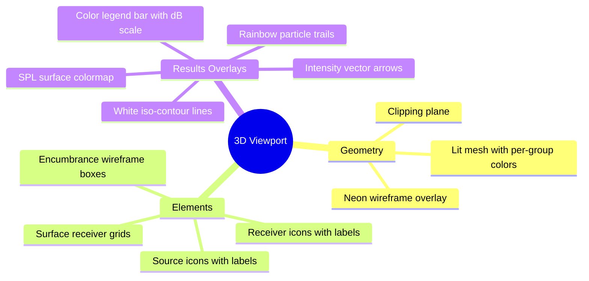
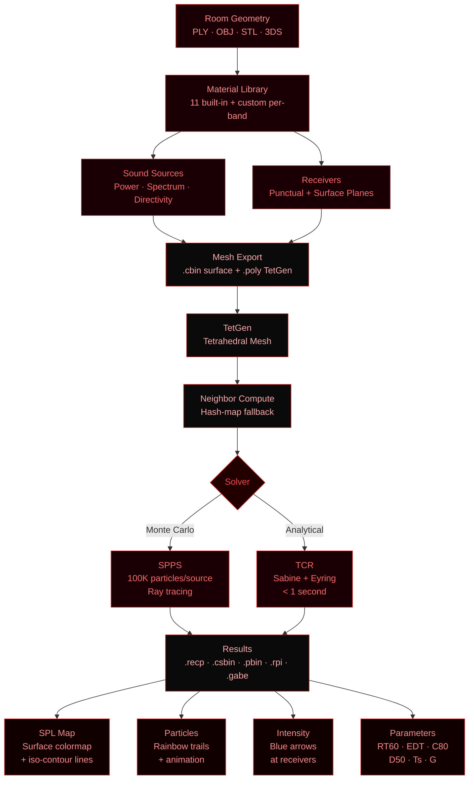

<p align="center">
  
</p>

<h1 align="center">I-SIMPA // NIGHT MODE</h1>

<p align="center">
  <strong>GPU-Accelerated Acoustic Simulation GUI</strong><br/>
  <em>Dark Neon Edition &mdash; Built for speed, precision, and beauty</em>
</p>

<p align="center">
  
  
  
  
  
</p>

---

## What Is This?

A from-scratch reimagining of [I-Simpa](https://i-simpa.univ-gustave-eiffel.fr/) &mdash; the open-source acoustic simulation platform from Universite Gustave Eiffel. Same solvers. Same physics. Completely new interface.

The original I-Simpa uses wxWidgets (2010-era UI). This version replaces it with a modern GPU-accelerated ImGui frontend with a dark neon aesthetic, real-time 3D visualization, and a workflow designed for 2026.



---

## Screenshots

> *Coming soon &mdash; the GUI speaks for itself. Launch it.*

---

## Features

### Simulation Engine

| Solver | Method | Speed | Use Case |
|--------|--------|-------|----------|
| **SPPS** | Monte Carlo particle tracing | 30-60s typical | Concert halls, studios, factories &mdash; geometry matters |
| **TCR** | Sabine / Eyring analytical | < 1 second | Quick RT60 estimates for simple rooms |

Both solvers produce:
- Per-receiver SPL across 27 third-octave bands (50 Hz &ndash; 20 kHz)
- Acoustic parameters: **RT60, EDT, C80, D50, Ts, G, LF**
- Echograms and Schroeder decay curves
- Surface colormaps with iso-contour lines
- Particle animation with rainbow trails
- Intensity vector visualization

### 3D Viewport



### Controls

#### Touchpad (Laptop)

| Gesture | Action |
|---------|--------|
| One-finger drag | **Orbit** &mdash; rotate view around model |
| Two-finger scroll | **Zoom** &mdash; in/out |
| Right-click drag | **Pan** &mdash; move scene without rotating |
| Tap surface | **Select** |
| Tap same surface | **Deselect** (toggle) |
| Tap empty space | **Deselect all** |
| Shift + tap | **Multi-select** |

#### Mouse

| Input | Action |
|-------|--------|
| Left drag | Orbit |
| Right drag | Pan |
| Scroll wheel | Zoom |
| Middle drag | Pan |
| Alt + left drag | Orbit (Blender-style) |
| Double-click | Focus on point |

#### Keyboard

| Key | Action |
|-----|--------|
| `W A S D` | Fly through scene |
| `Space / Ctrl` | Fly up / down |
| `Shift` | Sprint (3x speed) |
| `Escape` | Clear selection |
| `Delete` | Delete selected element |
| `Ctrl+P` | Command palette |
| `Ctrl+Z / Y` | Undo / Redo |
| `Ctrl+S` | Save project |
| `Ctrl+O` | Open project |
| `Ctrl+N` | New room |
| `F5` | Viewport only |
| `F6` | Results only |
| `F7` | All panels |
| `F8` | Viewport + Results |

---

## Simulation Pipeline



---

## Results Panel

Four visualization modes, one click each:

| Mode | What You See |
|------|-------------|
| **SPL Map** | Surface colormap on cutting planes. Click frequency bands to switch. Jet colormap with dB scale legend and white iso-contour lines. |
| **Particles** | Rainbow-colored particle animation. Play/Pause/Stop, step forward/back, speed slider 0.1x&ndash;4x. Each particle has a unique hue with fading trails. |
| **Intensity** | Blue arrows at receiver positions showing dominant sound arrival direction. |
| **Parameters** | Acoustic metrics table (RT60, EDT, C80, D50, Ts, G, SPL). Frequency response plot, echogram, Schroeder decay curve. CSV export. |

---

## Material System

11 built-in acoustic materials with per-band absorption data:

| Material | Avg Alpha | Color |
|----------|-----------|-------|
| Concrete | 0.02 | Gray |
| Wood Panel | 0.13 | Brown |
| Glass | 0.05 | Blue-green |
| Carpet | 0.50 | Red-brown |
| Acoustic Foam | 0.75 | Dark gray |
| Brick | 0.04 | Orange |
| Plaster | 0.03 | Off-white |
| Heavy Curtain | 0.49 | Dark red |
| 10% Absorbing | 0.10 | Medium gray |
| 20% Absorbing | 0.20 | Medium gray |
| 30% Absorbing | 0.30 | Medium gray |

Each material: 27 third-octave bands (50 Hz &ndash; 20 kHz), absorption + diffusion + transmission + diffusion law per band. Visual card UI with sparkline absorption curve. Click-to-assign workflow.

---

## CLI Automation

Run simulations without touching the GUI:

```bash
ISimpa_NewGUI.exe --auto \
  --load "concert_hall.ply" \
  --focus \
  --add-source "10,2,5,Stage_Speaker" \
  --add-receiver "20,1.2,10,Audience_Center" \
  --run-spps \
  --quit
```

| Flag | Effect |
|------|--------|
| `--auto` | Skip splash, enable automation |
| `--load <path>` | Load PLY/OBJ/STL/3DS/.isimpa/.proj |
| `--add-source x,y,z,name` | Place sound source |
| `--add-receiver x,y,z,name` | Place receiver |
| `--add-surface-receiver` | Add cutting plane at ear height |
| `--run-spps` | Run SPPS particle simulation |
| `--run-tcr` | Run TCR classical theory |
| `--focus` | Center camera on model |
| `--wait <seconds>` | Pause between commands |
| `--quit` | Exit after automation completes |

---

## Build

### Requirements

- Windows 11
- Visual Studio 2022 (MSVC)
- CMake 3.20+
- GPU with OpenGL 4.3+ (tested on RTX 2060)

### Steps

```bash
cd src/newgui
mkdir build2 && cd build2
cmake ..
cmake --build . --config Release
```

All dependencies (GLFW, ImGui, ImPlot, ImGuizmo, GLM, miniz) are fetched automatically via CMake FetchContent.

Solver executables (`spps.exe`, `classicalTheory.exe`, `tetgen.exe`, `preprocess.exe`) are copied to `Release/solvers/` automatically from the I-Simpa build tree.

### Run

```bash
cd build2/Release
./ISimpa_NewGUI.exe
```

---

## Project Structure

```
src/newgui/
  main.cpp                    Entry point, CLI arg parsing
  app/
    app.cpp                   Main loop, menus, automation, shortcuts
    app.h                     App state, automation queue
    theme.cpp                 Dark neon ImGui theme (all colors)
    theme.h                   NeonColors palette constants
    workflow_rail.cpp/.h       Visual phase indicator (left sidebar)
    selection.cpp/.h           Selection state (group/source/receiver)
  panels/
    outliner.cpp               Scene tree (groups, sources, receivers, fittings)
    properties.cpp             Property editor (context-sensitive)
    materials.cpp              Material card library with per-band editor
    results.cpp                Results panel (SPL Map / Particles / Intensity / Parameters)
    console.cpp                Message log + Python scripting console
  viewport/
    viewport.cpp               3D rendering, camera, picking, all overlays
    viewport.h                 Viewport API
    camera.cpp/.h              Orbit/pan/zoom/fly camera system
  mesh/
    scene_model.cpp/.h         Geometry data structures, box creation
    ply_loader.cpp             PLY/OBJ/STL/3DS file importers
    gpu_mesh.cpp               GPU mesh upload, shaders, wireframe
    miniz.*                    ZIP compression (for .proj loading)
  project/
    project.cpp/.h             Data model (materials, sources, receivers, config)
    solver.cpp/.h              Solver pipeline (mesh export, TetGen, config.xml, launch)
    result_parser.cpp/.h       Binary result file parsers (GABE, CSBIN, PBIN)
  commands/
    command_palette.cpp/.h     Ctrl+P fuzzy command search
  CMakeLists.txt               Build configuration
```

---

## Changelog

### v0.3.0 &mdash; Night Mode (2026-04-04)

**Core Simulation Fixes**
- Fixed `.cbin` writer: per-group structure with correct material IDs (was single "scene" group)
- Fixed `.mbin` neighbor computation: hash-map fallback when TetGen skips `.neigh` file
- Fixed coordinate transforms: canonical `GLtoISim()` / `ISimToGL()` helpers everywhere
- Fixed PLY loader: `layer_id` property correctly assigned to triangulated faces
- Fixed PLY loader: I-Simpa encoded layer names decoded (e.g. `"7 99 101..."` &rarr; `"ceiling"`)
- Fixed CSBIN parser: struct alignment padding handled (fvlen=8 for uint16+pad+float)
- Added `<subdomains/>` element to config.xml
- Added project validation before solver launch

**Results & Visualization**
- New Results panel with 4-mode selector (SPL Map / Particles / Intensity / Parameters)
- Surface colormap with log-scale dB normalization and semi-transparency
- White iso-contour lines on surface colormaps (marching triangles, every 3 dB)
- Color legend bar on viewport (gradient + min/max dB labels)
- Intensity vector arrows at receiver positions (blue, scaled by SPL)
- Rainbow particle trails with cubic fade and per-particle hue
- Auto-load results when simulation completes
- Two auto-generated surface receivers (floor map + vertical cross-section)
- Per-band frequency switching for surface colormaps
- CSV export for receiver results

**UI/UX**
- Touchpad-native controls (drag=orbit, two-finger=zoom, right-drag=pan)
- Click surface to select, click again to deselect (toggle)
- Click empty space or Escape to deselect
- Focus modes: F5 (viewport), F6 (results), F7 (all), F8 (viewport+results)
- Animation step buttons (|< >|) and speed slider (0.1x&ndash;4x)
- Frequency band preset buttons (Octave / 1/3 Octave / Clear)
- Ground type presets (Water through Urban, 8 types)
- Mesh quality parameters UI (TetGen quality ratio, volume constraint)
- Solver info panel explaining SPPS and TCR
- Command palette (Ctrl+P) with all actions
- Neon red theme (logo, borders, accents, rim lighting, wireframe)

**Architecture**
- CLI automation system (`--auto --load --run-spps --quit`)
- Native ZIP extraction via miniz (no PowerShell dependency)
- Integration test suite (`test_integration.py`)
- Removed heatmap (solid cubes &mdash; replaced by proper surface colormaps)

### v0.2.0 &mdash; Dark Neon (2026-03-29)

- Initial ImGui GUI with OpenGL 4.6 viewport
- SPPS and TCR solver integration
- PLY import with layer groups
- Material library with 11 presets
- Basic particle animation
- Project save/load (.isimpa XML)

---

## Credits

- **Solvers**: SPPS + TCR from [I-Simpa](https://github.com/Universite-Gustave-Eiffel/I-Simpa) (GPLv3)
- **GUI Framework**: [Dear ImGui](https://github.com/ocornut/imgui) (Docking branch) + [ImPlot](https://github.com/epezent/implot)
- **Mesh Generation**: [TetGen](https://wias-berlin.de/software/tetgen/)
- **3D Math**: [GLM](https://github.com/g-truc/glm)
- **Window**: [GLFW](https://www.glfw.org/)
- **ZIP**: [miniz](https://github.com/richgel999/miniz)

---

## License

GPLv3 &mdash; Same as I-Simpa upstream.

---

<p align="center">
  <strong>I-SIMPA // NIGHT MODE</strong><br/>
  <em>Sound. Visualized. Beautifully.</em>
</p>
