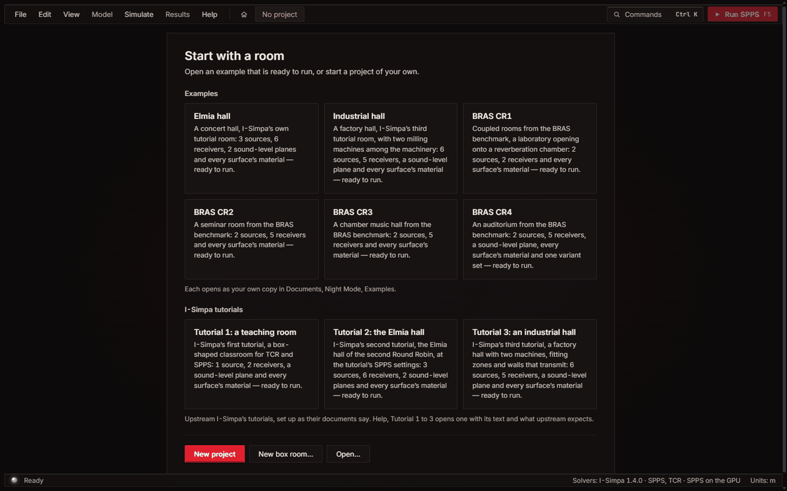
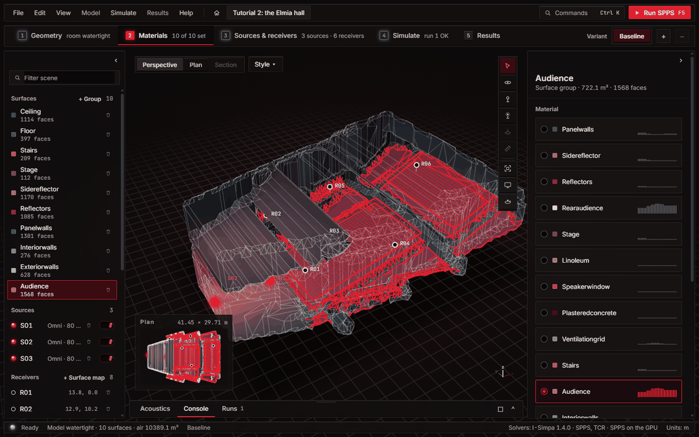
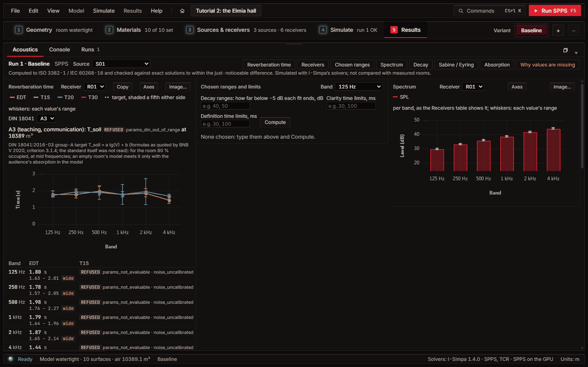
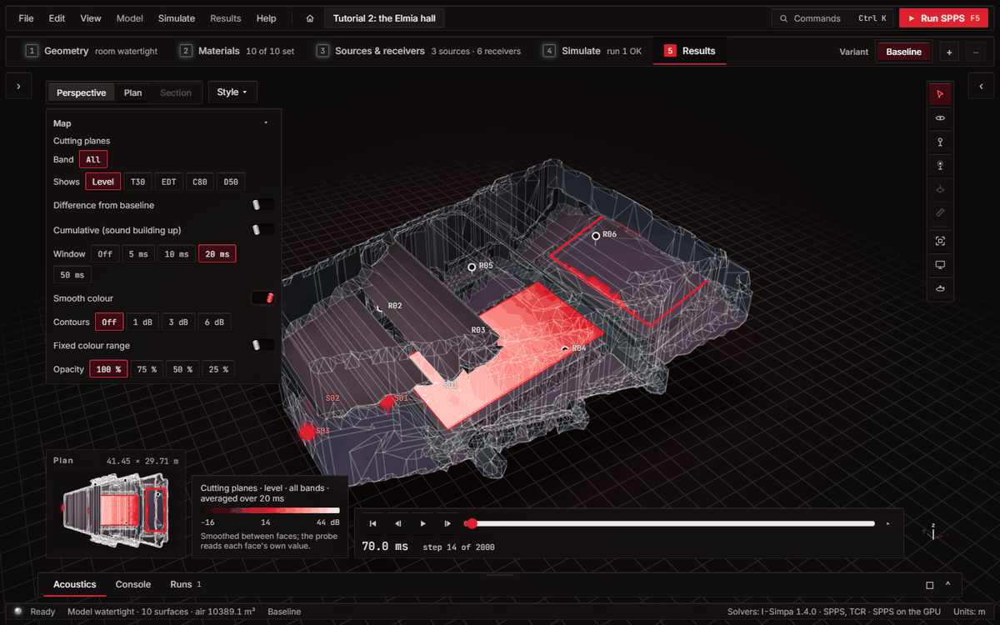
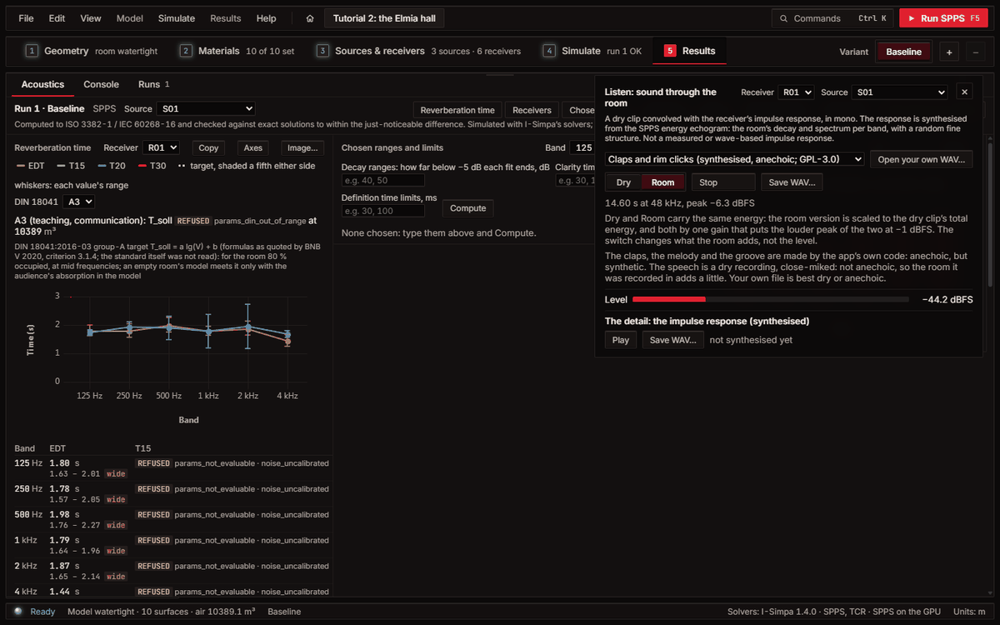

# I-Simpa Night Mode

A new desktop interface for room-acoustics simulation with the solvers of
[I-Simpa](https://github.com/Universite-Gustave-Eiffel/I-Simpa), the open-source project of
Université Gustave Eiffel: SPPS (sound particle tracing) and TCR (classical theory of reverberation, Sabine
and Eyring). It also carries this repository's own port of SPPS to NVIDIA graphics cards, SPPS on the GPU.

The solvers are upstream's, built from the pinned tag `v1.4.0_snapshot_14_01_2026` with the patches in
`patches/`. The interface is new and is not upstream's. Windows 10 and 11, x64. Licence: GPL-3.0.



## What it does

You give it a closed room model (PLY, OBJ, STL, or an upstream `.proj`), a material for every surface,
sources and receivers. It checks the model, meshes the room with TetGen, runs the solver in the background
and shows the results that pass its checks. The work is five steps: Geometry, Materials, Sources &
receivers, Simulate, Results.



The Acoustics tab gives SPL, G, EDT, T15, T20, T30, C50, C80, D50, Ts, STI and dB(A) per receiver and band,
computed to ISO 3382-1 and IEC 60268-16, each with its range. A value that does not pass its check is not
shown: its place says REFUSED and why.



SPPS runs also give sound maps on planes and surfaces (level, or T30, EDT, C80 and D50 per face), a
difference against another run, and particle playback when particles are saved.



Listen plays a dry clip through the room at a receiver, with and without the room, in mono. The room's
response is synthesised from the SPPS energy echogram; it is not a measured or wave-based impulse response.



The user manual is in the app (Help › User manual) and in this repository at
[`app/src-tauri/manual/manual.html`](app/src-tauri/manual/manual.html). Upstream's tutorials 1 to 3 are on
the start page, each with a page saying what upstream expects and what this build gives.

## Install

1. Download `I-Simpa-Night-Mode-<version>-<commit>-win64-setup.exe` and its `.sha256` from a release, or
   build them from source (below). Check the hash: `Get-FileHash <file>` in PowerShell.
2. Run it. It installs for the current user only and needs no administrator rights: into
   `%LOCALAPPDATA%\Programs\I-Simpa Night Mode`, with a Start menu entry, and `.simpa` files open in the app.
3. The installer is not code-signed, so Windows SmartScreen warns ("Windows protected your PC"). Choose
   **More info**, then **Run anyway**, once you have checked the hash.

The window needs the Microsoft Edge WebView2 Runtime. Windows 11 has it; when it is missing, the installer
runs Microsoft's WebView2 bootstrapper, which downloads it. The Visual C++ runtime the solvers need is
installed beside them; nothing else is required.

To uninstall, use Settings › Apps. The uninstaller removes the files it installed and nothing else, so a
project or a run saved inside the install folder stays.

**Requirements.** Windows 10 or 11, x64. The 3D view needs a GPU with WebGPU or WebGL2 through WebView2 (any
recent laptop GPU). SPPS on the GPU needs an NVIDIA card and a driver of the R580 series or newer (CUDA
13.2); its executable holds code for Turing (sm_75, with PTX for newer cards) and Blackwell (sm_120). Without
such a card the GPU entry is greyed with the reason, and SPPS and TCR run on the CPU. A project with fitting
zones, a stratified atmosphere or a measured directivity balloon is refused by the GPU solver; run it on SPPS.

## Build from source

One script builds everything and the installer: `tools\ci\build.ps1`. The GitHub Actions workflow
(`.github/workflows/build.yml`) runs the same script, so a local build and CI take the same path.

**Prerequisites**, all on `PATH` unless noted:

- Visual Studio 2022 with the *Desktop development with C++* workload (the MSVC x64 tools and a Windows SDK).
  The verified solver build used compiler 19.44.35226 (VS 2022 17.14).
- Git, CMake (the verified build used 4.3.2) and Python 3 from python.org (upstream's CMake configuration
  looks for its headers even though no Python bindings are built).
- Node.js 24 with npm.
- Rust through [rustup](https://rustup.rs); `rust-toolchain.toml` selects the toolchain (1.98.1).
- CUDA 13.2's `nvcc`, for SPPS on the GPU. Either install the CUDA Toolkit 13.2, or pass `-FetchCuda` and
  the script fetches the five parts of CUDA 13.2.1 that `nvcc` needs from NVIDIA's redistributable archives.
- Network access: GitHub (upstream I-Simpa, and Boost through upstream's CMake), npm, crates.io,
  SourceForge (NSIS 3.11 and SWIG 4.4.1, fetched by the script) and go.microsoft.com (the WebView2
  bootstrapper).

**Commands**, in Windows PowerShell:

```powershell
git clone https://github.com/Burhanuddin98/I-Simpa_Night_Mode.git
cd I-Simpa_Night_Mode
powershell -ExecutionPolicy Bypass -File tools\ci\build.ps1 -FetchCuda -AllowUnverifiedSolvers
```

The script, in order:

1. fetches NSIS 3.11 and SWIG 4.4.1 (each checked against a pinned sha256) and the WebView2 bootstrapper
   (its Microsoft signature is checked when the installer is built);
2. clones upstream I-Simpa at `v1.4.0_snapshot_14_01_2026` and checks its commit against
   `solvers/manifest.json`;
3. builds `spps.exe`, `classicalTheory.exe` and `preprocess.exe` from upstream plus `patches/`, and
   `tetgen.exe` from TetGen 1.5.0 in `third_party/tetgen-1.5.0` (`solvers\build.ps1`), then `spps-gpu.exe`
   (`solvers\spps-gpu\build.cmd`);
4. compares each solver's code sha256 (the sha256 with the link time zeroed, `solvers\pe-fingerprint.ps1`)
   with `solvers/manifest.json`;
5. builds the app: `npm ci`, then `npx tauri build --no-bundle` in `app\` (`CARGO_TARGET_DIR` is honoured);
6. builds the installer with `tools\installer\build-installer.ps1`.

The installer, its `.sha256` and `installer.json` (every file it carries, with its sha256) land in
`target\ci\installer\<version>-<commit>-<time>\`. `-Work`, `-Out`, `-CpmCache` and `-Upstream` move the
work folder, the output, the Boost download cache and the upstream checkout.

**Which solvers come out verified.** The app runs a solver only when its code sha256 is the one in
`solvers/manifest.json`; otherwise the run checklist shows "the verified build of the solvers" as Blocked.
With the compiler named above, `spps`, `classicalTheory`, `preprocess` and `tetgen` rebuild to the verified
code. `spps-gpu.exe` does not: `nvcc -lineinfo` writes the source and CUDA folders into its code, so a build
from any other folder differs. Without `-AllowUnverifiedSolvers` the script stops at that point; with it, the
installer is named `...-setup-unverified.exe`, `installer.json` lists each solver's verdict, and the app
then runs SPPS and TCR but refuses SPPS on the GPU. A different MSVC version can also change the code of the
CPU solvers, with the same consequence for them.

CI runs on `windows-2022` with `-FetchCuda -AllowUnverifiedSolvers` and uploads the installer and its
receipts as the `night-mode-installer` artifact; the job summary lists each solver against the manifest.

## What is verified, and what is not

- **Every value shown passes a check.** Each run's results are checked when it ends; a value that does not
  pass is shown as REFUSED with its reason, and "Why values are missing" lists the causes and the re-run that
  would fix each, when there is one.
- **The solvers are checked before every run**, by code sha256 against `solvers/manifest.json`, as above.
- **Upstream's tutorials 2 and 3 reproduce upstream's figures.** Tutorial 2: the decay of R01's echogram
  matches the rate read off upstream's figure. Tutorial 3: the difference map (absorbing wall minus
  reference) spans the range of upstream's legend within about 0.1 dB. Method and numbers:
  `docs/investigations/2026-10-09-tutorials/README.md`. Upstream's tutorial texts print no acoustic value, so
  these figures are the only comparison they allow. Tutorial 1 has nothing to compare against.
- **The results are simulations** with I-Simpa's solvers. They are not compared with measurements of real
  rooms here.
- **The two solver patches change storage, not physics, and each has a bed against upstream's own build.**
  `patches/0001-surface-receiver-time-bin.patch` and `patches/0002-sparse-surface-receiver-series.patch`
  change how SPPS and TCR store sound-map data (an optional coarser time bin for surface receivers; sparse
  storage of the map records), so that dense maps fit in memory. On a seeded BRAS CR4 SPPS run (3 bands,
  20,000 particles), the patched solver's output is byte-identical to the unpatched build's, 39 of 39 files,
  for both patches with the bin unset; with a 10 ms bin, every non-map file stays byte-identical and each
  map's total energy agrees within 5.3e-6 relative (float32 summation order). On a CR4 TCR run, every value
  in all 15 output files is identical with and without the patches. Receipts:
  `docs/investigations/2026-10-06-third-octave-bug/BED-0001.md`, `BED-0002.md` and `BED-TCR.md`. They fix
  no defect in upstream's solvers and make no claim about them.
- **Listen is mono**, and its impulse response is synthesised from the energy echogram.

**Not in this version** (from the manual): the Model and Results menus, the command palette, the section
view, the section plane and the measure tool are shown but disabled; a cumulative or time-windowed
parameter map, a difference of parameter maps, a cumulative difference and pausing a run are not there; a
variant cannot change one of several groups that an upstream project gave one material; a volume cannot be
named or made a fitting zone from the scene list, and a measured directivity balloon cannot be chosen;
upstream's embedded Python console and scripts, preferences, languages other than English and an update
check are not there.

## Repository layout

| path | what |
|---|---|
| `app/src-tauri/` | the desktop shell (Tauri 2, Rust): window, commands, the manual and the example projects |
| `app/ui/` | the interface (React, TypeScript, three.js) |
| `crates/simpa-core/` | the headless core: project model, solver input files, runs, results and their checks |
| `crates/simpa/` | `simpa`, a command line over the core |
| `solvers/` | the solver build scripts, `manifest.json` (the verified build), TetGen's build, `spps-gpu/` (the GPU port) |
| `patches/` | the patches applied to upstream's solver source |
| `third_party/tetgen-1.5.0/` | TetGen 1.5.0, the volume mesher, unmodified from WIAS's tarball |
| `tools/` | `ci/build.ps1`, the installer, the release gates, and development tools |
| `docs/` | plans, decisions, investigations and the scope ledger |

The C++ files at the top level and in `app/`, `commands/`, `glad/`, `mesh/`, `panels/`, `project/` and
`viewport/` (with `CMakeLists.txt` and `main.cpp`) are the April 2026 ImGui and OpenGL interface this one
replaced. Nothing in the installer is built from them.

## Licences

- **This repository** is free software under the GNU General Public License, version 3 (`LICENSE`).
- **I-Simpa's solvers** (SPPS, TCR, preprocess) are GPL-3.0-or-later, Copyright (C) 2007-2022 Université
  Gustave Eiffel. Upstream: <https://github.com/Universite-Gustave-Eiffel/I-Simpa>.
- **TetGen 1.5.0** (`tetgen.exe`), by Hang Si, WIAS Berlin, is dual-licensed: the GNU Affero General Public
  License, version 3, or a commercial licence from WIAS. This free release uses it under the AGPL-3.0; its
  source is in `third_party/tetgen-1.5.0` and its licence ships as `TETGEN-LICENSE.txt`. A closed or
  commercial distribution of `tetgen.exe` would need the WIAS licence.
- **The BRAS example rooms** are derived from the Benchmark for Room Acoustical Simulation (RWTH Aachen
  University, TU Berlin), CC BY-SA 4.0. The Elmia and industrial halls and the tutorials are upstream
  I-Simpa's, GPL-3.0. Sources: `app/src-tauri/examples/ATTRIBUTION.md`.
- **Everything else** the app and the solvers carry (Rust crates, JavaScript packages, fonts, Boost,
  TinyXML-2, the Visual C++ runtime, NSIS) is listed with its licence text in
  [`THIRD_PARTY_NOTICES.md`](THIRD_PARTY_NOTICES.md), which points to the generated notices file. Help ›
  About Night Mode shows the same texts.
